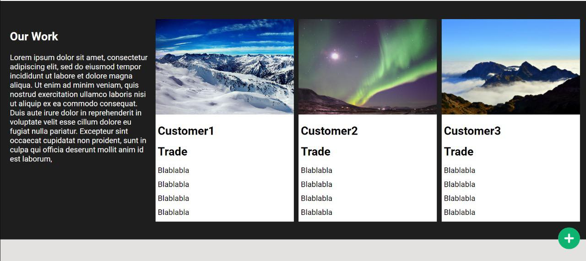

This repository is a Task for Bayt.com:

# Languages used HTML-CSS-JS

## Starter Html file

Web pages are defined with Html for content and CSS for style. Started by creating a file with the 'html'.

# 

## Html style

Styles include colors, borders, shadows and much more.

- JavaScript moved to separate file

- Images moved to saparate folder

  ***

  <<<<<<< HEAD

## Website images

=======

## Website images

> > > > > > > 71a2b3f97d72e371131d5604d5c89bc92caa54df

## Here is the app deployed on github pages

- [BAYT](https://1pyke.github.io/Bayt/)

## Here is the app on Sandbox

<<<<<<< HEAD

# [BAYT](https://codesandbox.io/s/sweet-sun-yorzeo?file=/style.css)

=======

- [BAYT](https://codesandbox.io/s/sweet-sun-yorzeo?file=/style.css)

> > > > > > > 71a2b3f97d72e371131d5604d5c89bc92caa54df
